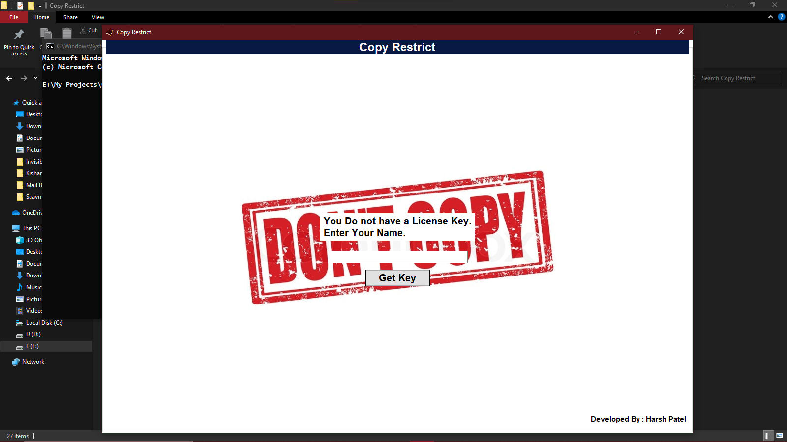
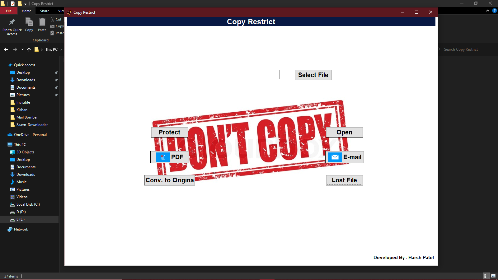

# Copy Restrict 
- It's freelance project I got. It's main function is restrict user to copy content of confidential file.
## Working 
- Firstly to install this software user need registration key, user can get key from admin.  
- It will protect file with random generated key.
- This file will only open with this software 
- So after opening protected file some thread look for the user activity and based on those activities it take action.
## Functionality 
- Protect/Open files
- Restrict user to copy
- Convert to PDF (MS Office needed)
- Convert back to original form
- Send email with in software
- File open With support 
## Installation 
```sh
pip install -r requirements.txt
```
- Run 
```sh 
python "Copy Restrict.py"
```
## Set Registration 
- Add "toaddr" and "fromaddr" and also generate app password for gmail and add it in "Validate.py" module to get key in your email
- At initial start of software, it ask for registration key which is generate by keygen.exe or keygen.py module by entering text which you received by mail.
## Snapshots
- Initial Start

- Home Page



